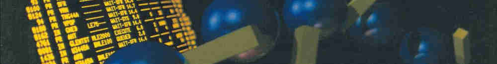

Avant-Garde Computing, Inc.:
*Net/Alert: the TP Performance Spotlight.*
(1970 - 1979)
[Source](https://www.computerhistory.org/brochures/a-c/avantgarde-computing-inc/)
[Link](https://s3data.computerhistory.org/brochures/avantgarde.netalert.1979.102641283.pdf)

Control Data Corporation:
*Weather by computer: A report from Control Data Corporation.*
(1963)
[Source](https://www.computerhistory.org/brochures/doc-43729572cf79f/)
[Link](https://s3data.computerhistory.org/brochures/cdc.weatherbycomputer.1963.102641261.pdf)

Honeywell Information Systems, Inc.:
*Honeywell: The Multics System.*
(1975)
[Source](https://www.computerhistory.org/brochures/doc-4372956d92711/)
[Link](https://s3data.computerhistory.org/brochures/honeywell.multicssystem.1975.102646162.pdf)

Cray Research, Inc.:
*VAX/VMS Station for Cray Computer Systems.*
(1986)
[Source](https://www.computerhistory.org/brochures/doc-4372956ea1171)
[Link](https://s3data.computerhistory.org/brochures/cray.vax-vms.1986.102646190.pdf)

---

Honeywell Information Systems, Inc.:
*Honeywell Level 68 Multics System: Focusing on Today's Interactive Processing Needs.*
(1973)
[Source](https://www.computerhistory.org/brochures/doc-4372956d8d8f1/)
[Link](https://s3data.computerhistory.org/brochures/honeywell.level68.1977.102646161.pdf)

Honeywell Information Systems, Inc.:
*U-COMP DDP-516 General Purpose I/C Digital Computer.*
(1966)
[Source](https://www.computerhistory.org/brochures/doc-4372956ed1eb7/)
[Link](https://d1yx3ys82bpsa0.cloudfront.net/brochures/honeywell.u-comp-ddp-516.102646115.pdf)

Honeywell Information Systems, Inc.:
*HONEYWELL 1800-II.*
(1964)
[Source](https://www.computerhistory.org/brochures/doc-4372956da1170/)
[Link](https://d1yx3ys82bpsa0.cloudfront.net/brochures/honeywell.1800ii.1974.102646163.pdf)

Digital Equipment Corporation (DEC):
*Programmed Data Processor-1.*
(1961)
[Source](https://www.computerhistory.org/brochures/doc-4372956d7a072/)
[Link](https://d1yx3ys82bpsa0.cloudfront.net/brochures/digital.pdp1.1961.102646097.pdf)

Shieldforyoureyes:
*Front panel from a PDP-11/70. From the collection at the RCS/RI..*
(2007)
[Source](https://en.wikipedia.org/wiki/File:Pdp-11-70-panel.jpg)
[Link](https://upload.wikimedia.org/wikipedia/commons/f/fe/Pdp-11-70-panel.jpg)

Morn:
*PDP-11/20. On display at the Musée Bolo, EPFL, Lausanne..*
(2013)
[Source](https://en.wikipedia.org/wiki/File:Digital_PDP11-IMG_1498_cropped.jpg)
[Link](https://upload.wikimedia.org/wikipedia/commons/5/54/Digital_PDP11-IMG_1498_cropped.jpg)

