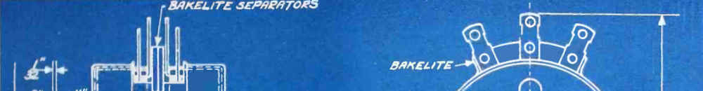

Decisions are illusions, especially difficult decisions. In reality, the only
choice available is to sit back and watch events unfold; there is only one way
in which they will unfold (at least in this universe), and that's the way things
are going to be.

Action must flow out of detachment from the "human" world of "I" and "mine"; it
must be free from thoughts of control, achievement, and getting things done.
Instead, the mind must be free to operate on the level of the mind, free to go
where mind goes. There is no thought of goal as effect; the mind knows what it
is doing when allowed so.

This is not passivity but a kind of wu wei---acting without forcing.
