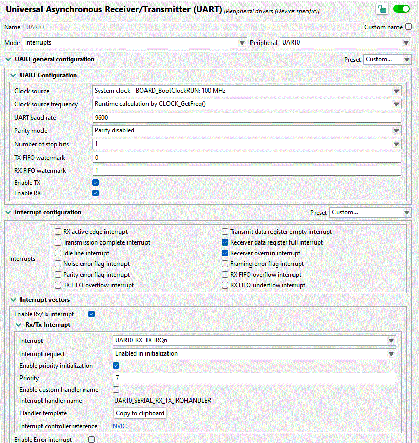
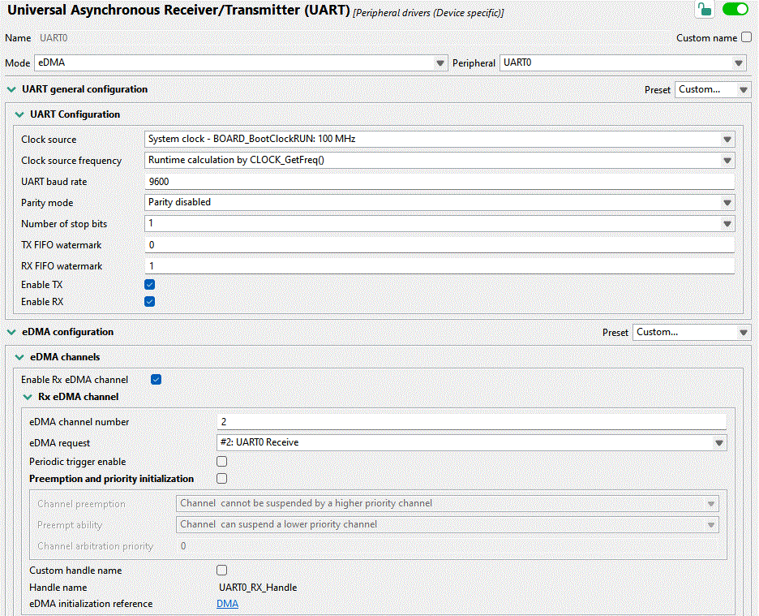

Working on a FreeRTOS-based project running on the NXP Kinetis K64, I wanted to
read data from several UART interfaces. The default "easy" method using
interrupts is easy to set up via the NXP MCUXpresso Config Tools; the problem is
that the UART peripheral only has a few bytes of built-in buffer. If the data is
arriving at the interfaces faster than the firmware can read it, the tiny buffer
immediately overflows and part of the data is lost.

This is obviously a task for Direct Memory Access (DMA): let the data arrive
into a much larger buffer, from where the software can take characters at its
leisure. In this article, we will briefly contrast three ways of receiving data
from UART: interrupt-based, simple DMA, and DMA with a circular buffer (aka ring
buffer).

### UART with Interrupts

The "point-and-click" method works out of the box with the Config tools. Leave
things at their default values, or change whatever is necessary. In my setup, I
had the values shown in the image below.

Even the interrupt handler is provided by the tool. Click on "Copy to
clipboard", and adapt as necessary. All that is needed is to read the status
flags and read a byte of data, and push it to a FreeRTOS queue that we set up
previously:

    void UART0_SERIAL_RX_TX_IRQHANDLER(void)
    {
       uint32_t intStatus = UART_GetStatusFlags(UART0);
       if ((kUART_RxDataRegFullFlag | kUART_RxOverrunFlag) & intStatus) {
          const uint8_t data = UART_ReadByte(UART0);
          xQueueSendToBackFromISR(rx_queue, &data, NULL);
       }
    }

This seems like it couldn't be simpler, and it just *should* work. Indeed, for
baud rates at or below about 9600, it does work almost reliably. And yet
sometimes, for no good reason, a byte gets dropped. Is that possible?

Let's see. At 115,200 baud, we get a character every 8.7 μs. It's entirely
possible that some other interrupt or critical section takes priority over this
one for much longer than that, especially looking at some of the rather long
Ethernet ISRs supplied with the NXP SDK. If we have less than 10 microseconds to
process a character before it goes away, we'll probably miss many of them!
Onwards to DMA.

### UART with eDMA

With direct memory access, the UART peripheral should be able to place the bytes
directly in a software buffer, without having to go through an RTOS queue.
Besides being much faster, we can also make the queue almost arbitrarily large,
ensuring that we'll be able to get to the data eventually and process it.

Thanks to the Config Tools, setting this up is again very straightforward. Just
enable some checkboxes and set up DMA channels, as I did in the image below.

This time, we do not have a handy "Click to get code" button. Instead, ChatGPT
or Gemini or Claude are happy to write something that nearly works. In a
dedicated FreeRTOS task, let's poll for characters as they arrive into the
buffer:

    for (;;) {
       uint32_t bytesWritten;
       if (UART_TransferGetReceiveCountEDMA(UART0_PERIPHERAL,
                &UART0_UART_eDMA_Handle,
                &bytesWritten) != kStatus_Success) {
          vTaskDelay(pdMS_TO_TICKS(1));
          continue;
       }

       while (readIndex != (bytesWritten % DMA_BUF_SIZE)) {
          char c = uartRxBuf[readIndex];
          readIndex = (readIndex + 1) % DMA_BUF_SIZE;
          // now do what you want with the received character
       }

       vTaskDelay(1);
    }

Note the `vTaskDelay(1)` calls which ensure that this task does not starve
lower-priority tasks of processor time.

In the above, the chatbot made use of the function
`UART_TransferGetReceiveCountEDMA()` from the NXP SDK and implemented the ring
buffer wraparound with some modulo operation that's probably about correct. But
what happens when the buffer gets filled up? In that case, an interrupt triggers
the DMA callback, which simply restarts the DMA to receive data back into the
beginning of the buffer:

    static void uart0_callback(UART_Type *base, uart_edma_handle_t *handle,
                               status_t status, void *userData)
    {
        uart_transfer_t rxXfer = {
            .data = uartRxBuf,
            .dataSize = DMA_BUF_SIZE
        };
        UART_ReceiveEDMA(UART0_PERIPHERAL, handle, &rxXfer);
    }

This works great, but has an unfortunate limitation. When the buffer is at the
end of its capacity, characters must arrive slowly enough so we have time to
re-start the DMA. In other words, we have not solved anything! Data will
occasionally get lost when the callback is executing.

Naturally, the DMA should be writing continuously without us having to restart
it. Much back and forth with AI achieved nothing. The version of the NXP SDK
that I'm using, while full of intricate code covering what appears to be almost
every possible use case, somehow does not cover the most elementary DMA
operation: continuous data reception.

### True continuous DMA ring buffer

This brings us to the final section: how to make the ring buffer work without
stopping? By my count, the SDK takes 4517 lines of C to implement the
"simplified" DMA configuration code, and yet there's no easy
`UART_MakeMeARingBuffer()`. There are 80 pages in the K64 Sub-Family Reference
Manual about the DMA, and 85 about UART, with lots of tables of registers, flow
charts, diagrams. Enough to leave one entirely mystified.

The key revelation here is that the *DMA peripheral is not nearly as complicated
as NXP would have us believe.* As it turns out, there are only a couple fields
one has to fill out in the "transfer control descriptor" (TCD): source and
address of the data, the size of each logical word (for UART: one byte), how
many bytes to write altogether, and what to do after writing them.

To integrate it with the code generated by the Config Tools above, we need the
handles to the UART and eDMA controls, and a buffer to place the data in:

    UART_Type *uart = UART0_PERIPHERAL;
    edma_handle_t *dma = &UART1_RX_Handle;

    #define BUF_SIZE 256
    static uint8_t buf[BUF_SIZE];

Next, we define the source (UART buffer) and destination for the data:

    edma_tcd_t *tcd = (edma_tcd_t *)&dma->base->TCD[dma->channel];
    tcd->SADDR = UART_GetDataRegisterAddress(uart);
    tcd->DADDR = (uint32_t)buf;

Fill in the source and destination offset, number of bytes to transfer at once
(just one byte), and number of bytes to transfer in a so-called "major loop"
(equal to the size of the ring buffer):

    tcd->SOFF = 0;
    tcd->DOFF = 1;
    tcd->NBYTES = 1;
    tcd->ATTR = DMA_ATTR_SSIZE(kEDMA_TransferSize1Bytes) | DMA_ATTR_DSIZE(kEDMA_TransferSize1Bytes);
    tcd->CITER = BUF_SIZE;
    tcd->BITER = BUF_SIZE;
    tcd->DLAST_SGA = -BUF_SIZE;

Note the `DLAST_SGA` field: it causes the write address to be rewound back to
the start of the data buffer upon completing the major loop. This is really all
that's needed to create a true circular ring buffer that runs without stopping.

Finally, to make it run, we need to enable the DMA service request from both the
eDMA and UART sides:

    dma->base->SERQ = DMA_SERQ_SERQ(dma->channel);
    uart->C5 |= (uint8_t)UART_C5_RDMAS_MASK;
    uart->C2 |= (uint8_t)UART_C2_RIE_MASK;

*Beware:* If making use of any NXP-provided functions, know that several of them
implicitly set the `DREQ` bit ("Disable Request") which will stop DMA once a
single major loop is complete. As the Reference Manual puts it,

> `DREQ` (Disable Request) If this flag is set, the eDMA hardware automatically
> clears the corresponding `ERQ` bit when the current major iteration count
> reaches zero.

### Readout from the buffer

Once the DMA is happily streaming UART bytes into the buffer, we would like to
get it out.  The simplest way to do so would be a character at a time,
`getc`-style.

Step One: consult the DMA registers about the current iteration inside a major
loop:

        uint32_t ch   = dma->channel;
        const uint16_t biter = dma->base->TCD[ch].BITER_ELINKNO;
        const uint16_t citer = dma->base->TCD[ch].CITER_ELINKNO;

Step Two: compute the number of bytes available in the buffer.

        size_t write_index = (biter - citer) % UART_DMA_BUF_SIZE;
        int avail = 0;
        if (write_index >= *head) {
           avail = write_index - *head;
        } else {
           avail = (UART_DMA_BUF_SIZE - *head) + write_index;
        }

Step Three: If any bytes are available for readout, let's read it out (into the
variable `c`), then advance the queue pointer:

        if (avail) {
           uint8_t c = buf[*head];
           *head = (*head + 1) % UART_DMA_BUF_SIZE;
        }

That's it!

### Conclusion

My intention with this writeup was to show that DMA configuration on the Kinetis
K64 is very simple once one learns to let go of the tools that are supposed to
make it easier: the NXP SDK, the Config Tools GUI, the Reference Manual. 17
lines of code is all it takes to configure a UART ring buffer with DMA!

Direct manipulation of system registers may appear confusing. After all, where
is one supposed to learn which are all the registers that must be set? The SDK
is often the only entry point, but it's discouraging: confusing,
over-engineered, and ironically missing the simplest features.

It's an amusing experience to take the "official" code examples and manually
inline all the functions, unfolding the complex call chain into hundreds of
lines of code. Once all the unnecessary conditional compilation and inapplicable
conditions are removed, you can often be left with just a handful of lines of
simple code which, with the help of the reference manual, is pretty readable.
Certainly more than the mostly undocumented, partially implemented SDK morass of
functions, drivers, modules, what have you!
