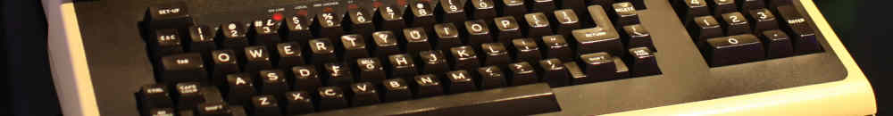

*This is Part 6 in the series: Linux on STM32MP135. [See other
articles.](#series-list)*

This is a record of steps I took to successfully get Linux past the early boot
stage on my custom board using the STM32MP135 SoC. (Schematics, PCB design
files, and code available in this
[repository](https://github.com/js216/stm32mp135_test_board).) The write-up is
in approximate chronological order, written as I go through the debugging steps.

### Blink

I had previously put together a simple bare-metal
[program](https://github.com/js216/mp135_boot/tree/main/blink_noide) that runs
on the STM32MP135 evaluation board and just blinks the LED. To work on the
custom board, I needed only to remove anything to do with the STPMIC1 and LSE
clock (the low-speed external 32.768 kHz clock), since I did not place these
parts on my board. The [resulting
code](https://github.com/js216/stm32mp135_test_board/tree/main/baremetal/blink)
is pretty simple modulo complexity inherited from the ST drivers.

To download the code, I talked directly to the ROM bootloader on the SoC. See
[this article](boot-stm32mp135-over-uart-with-python) for details.

### DDR

Again, I had previously put together a [simple
program](https://github.com/js216/mp135_boot/tree/main/ddr_test) to test the DDR
on the evaluation board. It fills the memory entirely with pseudorandom bits
(PRBS-31), and then reads it out, checking that the data matches.

For the custom board, the program had to be modified similarly as with blink
(remove STPMIC1, LSE clock) and then it ran. [(Click for
code.)](https://github.com/js216/stm32mp135_test_board/tree/main/baremetal/ddr_test)

There was an issue: all data read back was wrong and subtly corrupted. I double
checked the wiring, DDR parameter configuration (I use the same DDR as the eval
board, so what could it be!?), the code---only to realize the board was not
getting enough current on the 1.35V power supply. With more power, everything
*just worked*!

### JTAG

For JTAG loading it appears to be essential to select "Development boot" (also
called "Engineering boot") by selecting the boot pins in the `100` setting. The
datasheet says this mode is used "Used to get debug access without boot from
flash memory".

There is also a footnote that says that the core is "in infinite loop toggling
PA13", but I did not observe the toggling in the "dev boot" mode, even though it
is of course present (but not documented) in the normal UART boot mode (pins =
`000`).


Unfortunately I covered the J-Link connector with solder mask. After trying to
carefully scratch it off using a sewing needle, the connection appears to be
intermittent. Sometimes J-Link was able to download the DDR test program to the
SYSRAM, but most of the time it couldn't. Probably it would work just fine if it
wasn't for the soldermask covering. I wish I had just used a normal pin-header
connector rather than the J-Link needle adapter. So, I'll have to use UART boot
mode for now, and hope that I can get the (much faster) USB mode to work.

### SD

*Note: read the full SD card story
[here](https://embd.cc/sdcard-on-bare-metal-stm32mp135).*

On the STM32MP135 evaluation board, an SDMMC example reliably reads a program
from an SD card into DDR and executes it, but porting the same code to a custom
board exposed a failure during SD initialization. Although command-level
communication succeeded—CMD0, CMD8, CMD55, and ACMD41 all completed normally and
the card identified as SDHC—the sequence consistently failed later in
`SD_SendSDStatus` with `SDMMC_FLAG_DTIMEOUT`. Hardware checks showed that SD
card power, SDMMC I/O domain voltages, and signal levels all matched the
evaluation board, with clean 3.3 V logic and a low clock rate of about 1.56 MHz.
The decisive difference turned out to be signal pull-ups: the evaluation board
routes SD signals through an ESD device with built-in pull-ups, whereas the
custom board did not. Enabling internal pull-ups on the SD data lines eliminated
the data timeout and allowed SD reads to proceed, confirming that missing
pull-ups were responsible for the initialization failure.

However, once SD transfers succeeded, the data read from the card appeared
corrupted in DDR: roughly every other byte was intermittently wrong, always off
by exactly two, independent of bus width, clock edge, power supply, or signal
integrity. The critical observation was that data read into a static buffer in
SYSRAM was always correct, while corruption appeared only after copying that
data into DDR using byte-wise writes such as memcpy. When DDR was written using
explicit, 32-bit aligned word accesses, the corruption disappeared entirely. The
root cause was therefore not the SD interface but unaligned byte and half-word
writes to DDR, which violate the STM32MP13 DDR/AXI access requirements and can
cause timing-dependent data corruption, especially when interacting with
uncached memory and peripheral-driven transfers. Ensuring that all DDR writes
are word-sized and properly aligned fully resolved the issue and restored
correct, reproducible SD card operation on the custom board.

### USB

*Note: read the full USB story
[here](https://embd.cc/usb-bringup-on-custom-stm32mp135-board).*

Getting USB working on a custom STM32MP135 board involved a few key hardware and
software steps. First, I enabled the USBHS power switch by adding a
current-limit resistor so the PHY would receive power. On the board, I removed
the permanent 1.5 kΩ pullup on the D+ line to allow proper High-Speed
enumeration. I also ensured JTAG worked reliably by booting in engineering debug
mode and verifying the vector table took interrupts in ARM mode.

On the software side, I disabled VBUS sensing in the HAL PCD initialization to
match the externally powered board, configured the Rx/Tx FIFOs, and made sure
all required USB interrupts were correctly handled. For the USB Device stack, I
added the necessary callbacks in `usbd_conf.c` and applied volatile casts to
ensure 32-bit accesses to SYSRAM were aligned, avoiding Data Aborts.

Finally, I verified proper memory alignment for DDR writes to ensure file
transfers worked without byte shuffling, and confirmed enumeration and data
transfers at High-Speed using a good USB cable and port. After these steps, the
board enumerated correctly as an MSC device, and read/write operations
functioned reliably.

### Switch to Non-Secure World

*Note: read the full TrustZone story
[here](https://embd.cc/unsecuring-stm32mp135-trustzone).*

The STM32MP135 integrates the Arm TrustZone extension which partitions the
system into two isolated security domains, the secure and non-secure worlds,
depending on the state of the `NS` bit in the `SCR` register. Before the bit is
flipped, we need to unsecure many parts of the SoC (DDR, DMA masters, etc).

### Debug Linux early boot

Since Linux is just another program, why not try and run it, now that we have
disabled most secure-world hindrances? One thing to keep in mind is to respect
the link address:

```sh
buildroot]> readelf -h output/build/linux-custom/vmlinux | grep Entry
  Entry point address:               0xc0008000
```

Let's copy the binary instructions from the ELF file into something we can load
into memory:

```sh
arm-none-eabi-objcopy -O binary \
    output/build/linux-custom/vmlinux \
    output/images/vmlinux.bin
```

Now we place the binary file in the same SD card image as the bootloader:

```sh
$ python3 scripts/sdimage.py build/sdcard.img build/main.stm32 build/vmlinux.bin

File                      LBA      Size       Blocks
-------------------------------------------------------
main.stm32                128      100352     197
vmlinux.bin               324      19111936   37329
```

Load the ~40,000 blocks from logical block address (LBA) 324 into DDR to
location `0xC0008000`, and jump to it. If we follow along with the debug probe,
we see that the kernel begins executing in `arch/arm/kernel/head.S` and gets
stuck when it realizes that we did not pass it the correct boot parameters.

### Provide a Device Tree Blob

Let's start with the default DTB and decompile it into the DTS:

```sh
[buildroot]> dtc -I dtb -O dts -@ \
   output/build/linux-custom/arch/arm/boot/dts/stm32mp135f-dk.dtb > \
   ~/temp/build/min.dts
```

Now remove as much of the unnecessary peripherals from the device tree and
compile back into a DTB:

```sh
dtc -I dts -O dtb min.dts > min.dtb
```

Next, we need to include this DTB in the SD card image:

```sh
$ python3 scripts/sdimage.py build/sdcard.img build/main.stm32 \
    build/vmlinux.bin build/min.dtb

File                      LBA      Size       Blocks
-------------------------------------------------------
main.stm32                128      100352     197
vmlinux.bin               324      19111936   37329
min.dtb                   37652    53248      105
```

Write the new image to the SD card, and boot the bootloader, and copy the kernel
and the DTB to DDR:

```
> l 40000 324 0xc0008000
Copying 40000 blocks from LBA 324 to DDR addr 0xC0008000 ...
> l 105 37652 0xc2008000
Copying 105 blocks from LBA 37652 to DDR addr 0xC2008000 ...
> p 256 0xc2008000
0x00000000 : d0 0d fe ed  00 00 ce 12  00 00 00 38  00 00 bc c4  ...........8....
0x00000010 : 00 00 00 28  00 00 00 11  00 00 00 10  00 00 00 00  ...(............
0x00000020 : 00 00 11 4e  00 00 bc 8c  00 00 00 00  00 00 00 00  ...N............
0x00000030 : 00 00 00 00  00 00 00 00  00 00 00 01  00 00 00 00  ................
0x00000040 : 00 00 00 03  00 00 00 04  00 00 00 00  00 00 00 01  ................
0x00000050 : 00 00 00 03  00 00 00 04  00 00 00 0f  00 00 00 01  ................
0x00000060 : 00 00 00 03  00 00 00 32  00 00 00 1b  53 54 4d 69  .......2....STMi
0x00000070 : 63 72 6f 65  6c 65 63 74  72 6f 6e 69  63 73 20 53  croelectronics S
```

We can match the print against the DTB hexdump to verify that it's been written
correctly (note the "d00dfeed" at the start of the DTB). Then issue the `j` or
`jump` instruction, and follow along with the debugger:

```
gdb)
69         push  {r4} // CPSR after return
(gdb) del
(gdb) si
sm_smc_entry () at src/handoff.S:70
70         push  {r3} // PC after return
(gdb)
sm_smc_entry () at src/handoff.S:71
71         rfefd sp
(gdb)
0xc0008000 in ?? ()
(gdb) file build/vmlinux
Reading symbols from build/vmlinux...
(gdb) si
__hyp_stub_install () at arch/arm/kernel/hyp-stub.S:73
73      arch/arm/kernel/hyp-stub.S: No such file or directory.
(gdb) directory build/linux-custom
Source directories searched: build/linux-custom;$cdir;$cwd
(gdb) si
0xc01149a4      73              store_primary_cpu_mode  r4, r5
```

Above we see the last three instructions from the bootloader, and then we need
to switch GDB to the Linux kernel executable, and provide it the source code
directory. Then, we see one of the first instructions from the kernel being
executed, on line 73 of `hyp-stub.S`.

Step instruction (`si`) a couple times until we reach the branch to
`__vet_atags`. That routine is responsible to determine the validity of the `r2`
pointer that the bootloader is supposed to point to where we copied the DTB in
the memory. Let's see what happens:

```
__vet_atags () at arch/arm/kernel/head-common.S:44
44              tst     r2, #0x3                        @ aligned?
45              bne     1f
47              ldr     r5, [r2, #0]
49              ldr     r6, =OF_DT_MAGIC                @ is it a DTB?
50              cmp     r5, r6
51              beq     2f
61      2:      ret     lr                              @ atag/dtb pointer is ok
```

Evidently the DTB pointer is good! Now we return back to the startup code and
proceed with enabling MMU, clearing memory, etc. I got tired of single-stepping
through `memset` and hit continue, and was amazed to find the following on the
serial monitor:

```
[    0.000000] Booting Linux on physical CPU 0x0
[    0.000000] Linux version 6.1.28 (jk@SRS1720) (arm-buildroot-linux-uclibcgnueabihf-gcc.br_real (Buildroot 2024.11-202-g3645e3b781-dirty) 13.3.0, GNU ld (GNU Binutils) 2.42) #1 SMP PREEMPT Thu Dec 18 17:02:40 PST 2025
[    0.000000] CPU: ARMv7 Processor [410fc075] revision 5 (ARMv7), cr=10c5387d
[    0.000000] CPU: div instructions available: patching division code
[    0.000000] CPU: PIPT / VIPT nonaliasing data cache, VIPT aliasing instruction cache
[    0.000000] OF: fdt: Machine model: STMicroelectronics STM32MP135F-DK Discovery Board
[    0.000000] Memory policy: Data cache writealloc
[    0.000000] cma: Reserved 64 MiB at 0xdc000000
[    0.000000] Zone ranges:
[    0.000000]   Normal   [mem 0x00000000c0000000-0x00000000dfffffff]
[    0.000000]   HighMem  empty
[    0.000000] Movable zone start for each node
[    0.000000] Early memory node ranges
[    0.000000]   node   0: [mem 0x00000000c0000000-0x00000000dfffffff]
[    0.000000] Initmem setup node 0 [mem 0x00000000c0000000-0x00000000dfffffff]
```

In other words: *IT WORKS!!!*

### Discussion

There's an important step that had to take place before the "blink" example
could run on the custom board: *let go of the sheer excitement*. Having worked
on or with some kind of a Linux system for perhaps two decades, it was an almost
surreal, mystical feeling to hold in my hands a board that I designed myself
that is supposed to run the operating system. It's what makes engineering a
rewarding experience, but the mental jitter of it can also interfere with
getting things done. After all, this is just routine work!

<div class="series-box">
<h3 id="series-list">All Articles in This Series</h3>
<ul>
  <li><a href="stm32mp135-linux-default-buildroot">1. STM32MP135 Default Buildroot Configuration</a></li>
  <li><a href="stm32mp135-linux-cubeprog">2. STM32MP135 Flashing via USB with STM32CubeProg</a></li>
  <li><a href="stm32mp135-without-u-boot">3. STM32MP135 Without U-Boot (TF-A Falcon Mode)</a></li>
  <li><a href="linux-tfa-bl33-qemu">4. Linux as TF-A BL33 on Qemu (No U-Boot)</a></li>
  <li><a href="stm32mp135-without-optee">5. STM32MP135 Without OP-TEE</a></li>
  <li><em>6. This article</em></li>
  <li><a href="build-linux-for-stm32mp135-in-under-50-lines-of-makefile">7. Build Linux for STM32MP135 in under 50 Lines of Makefile</a></li>
</ul>
</div>
