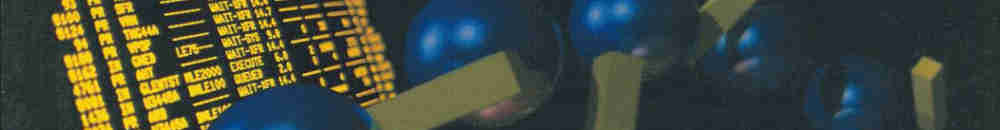
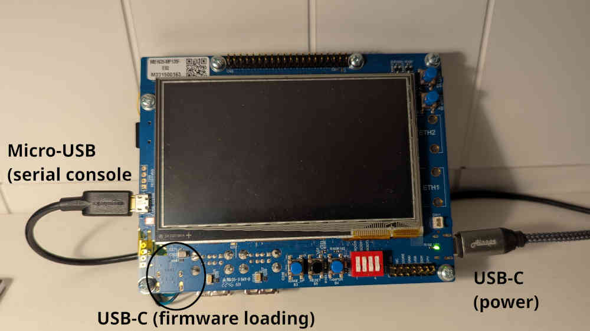
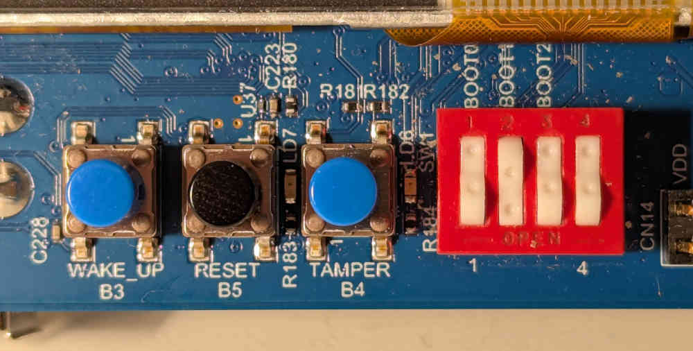

*This is Part 1 in the series: Linux on STM32MP135. [See other
articles.](#series-list)*

Wouldn't it be great to have a single board computer that runs *just Linux*?
That is, no external libraries, tools, driver modules---just the kernel binary,
and whichever programs you *choose* to run under it. After all, Linux is just a
C program, so how hard can it be to compile and run it? Read on to get started
exploring the wild world of embedded Linux.

### Tutorial

In this tutorial, we show how to get a basic "minimal" Linux installed on the
[STM32MP135 evaluation
board](https://www.st.com/en/evaluation-tools/stm32mp135f-dk.html) with a
minimum of steps or obscure scripts. For detailed explanations, refer to the
excellent writeup from [Bootlin.](
https://bootlin.com/blog/building-a-linux-system-for-the-stm32mp1-basic-system/)

1. Get a copy of Buildroot:

   ```sh
   $ git clone https://gitlab.com/buildroot.org/buildroot.git
   $ cd buildroot
   ```

   As of this writing, the latest commit in this repository is

   ```sh
   $ git rev-parse HEAD
   bbb0164de08f761a3399c961700db44befff5c70
   ```

2. Find the default configuration appropriate for this board:

   ```sh
   $ make list-defconfigs | grep stm32mp135
   ```
   
   This shows that `stm32mp135f_dk_defconfig` is available. Install it by calling
   make on it:
   
   ```sh
   $ make stm32mp135f_dk_defconfig
   ```

   Let's enable the USB mode for Arm Trusted Firmware (TF-A) so that we will be
   able to use USB flashing in the future. Open

   ```sh
   $ make menuconfig
   ```

   Navigate under `Bootloaders --->  ARM Trusted Firmware (ATF)` and add the
   following at the end of the "Additional ATF build variables" string:

   ```
   STM32MP_USB_PROGRAMMER=1
   ```

   Then select "OK", and "Esc" your way out of the menuconfig. Make sure to say
   "Yes" when asked whether to save the new configuration.

3. Run the build, and collect logs into a file:

   ```sh
   $ time make >log.txt 2>&1
   ```
   
   On my dual-core i5-7300U laptop, this took about an hour and a half.
   
   Watch the build from another terminal:
   
   ```sh
   $ tail -f log.txt
   ```

4. Copy the generated image to an SD card (assumed to be at `/dev/sdb`):

   ```sh
   $ sudo dd if=output/images/sdcard.img of=dev/sdb bs=1M
   ```

5. Time to run it on the evaluation board! Set it up as follows:

   - Insert the SD card into the slot
   - Connect the USB-C port to the right of the screen (`CN12`, labelled `PWR_IN`)
     to a powered USB hub
   - Connect the Micro USB (`CN10`, left of the screen) to a desktop computer,
     which will enumerate as a serial port (`/dev/ttyACM0` on my computer).
   - Open a serial console (115200 baud, no parity) to listen
   
   
   
   Set the DIP switches to boot from the SD card as shown in the image below. In
   this orientation, press in on the upper side of the rockers of `BOOT0` and
   `BOOT2`, and on the lower side for `BOOT1`.
   
   
   
   Press the black reset button and if everything went right, you should see the
   kernel boot messages displayed on the serial monitor, until the login prompt
   gets displayed. Done!
   
   ```
   Welcome to Buildroot
   buildroot login: root
   # uname -a
   Linux buildroot 6.12.22 #1 SMP PREEMPT Wed Sep  3 20:23:46 PDT 2025 armv7l GNU/Linux
   ```

### Discussion

This is, to my knowledge, the fastest way to get started with embedded Linux on
"real" hardware in terms of number of steps. However, it does not result in the
most minimal distribution. Besides the Linux kernel, the default configuration
pulls in a number of large programs, such as U-Boot, ATF, OP-TEE, and more.
(Examine `buildroot/dl`) after building to see all the stuff that got downloaded
in the build process.)

For someone used to bare-metal embedded work, the size and complexity of this
auxiliary software is utterly baffling. A bootloader with more lines of code
than my whole project? Several different compilers and interpreters (C, Rust,
Perl, Python) needed for a "Hello, world!?"

In my mind I hold an ideal of the "pure" essence of Unix: there is one kernel,
which at the end of its boot process invokes one user-space program (`init`),
which then does anything it wants to. I believe in the simplicity of the Linux
boot process, as outlined by Russell King in the 2002 masterpiece, ["Booting ARM
Linux"](https://www.kernel.org/doc/Documentation/arm/Booting):

1. Initialize RAM and copy the kernel into it
2. Initialise one serial port
3. Load the device tree blob (DTB) into RAM, and place its address in `r2`
4. Pass control to Linux and watch it boot like magic!

It is time we regain the pristine uncomplicated state that used to exist before
everything became bundled and containerized and wrapped inside countless layers
of abstraction that are supposed to make things simpler, but in the end serve
only to confuse everyone.

In the next articles, we will take this "primordial mess" and cut it down to
size. Stay tuned!

<div class="series-box">
<h3 id="series-list">All Articles in This Series</h3>
<ul>
  <li><em>1. This article</em></li>
  <li><a href="stm32mp135-linux-cubeprog">2. STM32MP135 Flashing via USB with STM32CubeProg</a></li>
  <li><a href="stm32mp135-without-u-boot">3. STM32MP135 Without U-Boot (TF-A Falcon Mode)</a></li>
</ul>
</div>
