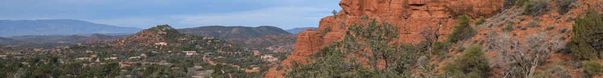

There's an idea floating around: that speaking too soon---or too publicly---can
distort intention, dissipate effort, or corrupt meaning. Yet what silence
*protects* differs: power, purity, clarity, or effectiveness. Here we take a
ten-second look at a couple interesting specimens.

### Eliphas Levi (Ceremonial Magic)

Eliphas Levi insists that magical operations must be kept secret because
publicity disperses will and invites opposition; the act of speaking converts a
focused intention into a social object, weakening its efficacy as an operation
of directed will.[^1]

### Aleister Crowley (Thelema)

Aleister Crowley codifies silence as a discipline of the magician: one must
avoid discussing one's Work because speech leaks energy and entangles the will
in ego and external reactions, thereby degrading the precision required for
successful magical action.[^2]

### Franz Bardon (Hermetic Training)

Franz Bardon treats silence as a technical requirement of mental training:
revealing intentions or progress disrupts concentration and allows external
influences to interfere with the equilibrium necessary for effective
practice.[^3]

### Napoleon Hill (Early New Thought Influence)

Napoleon Hill advises keeping plans private until they are realized because
external opinions introduce doubt and erode persistence; silence protects the
fragile early stage where belief must be maintained without contradiction.[^4]

### Neville Goddard (Imaginative Creation)

Neville Goddard emphasizes inner conviction over external discussion; speaking
about a desire before it is realized shifts attention from imagination to social
validation, weakening the sustained assumption required to bring it about.[^5]

### Jesus (Gospel of Matthew)

Jesus explicitly commands that prayer, fasting, and charity be done in secret so
that the act is not redirected toward human approval; speaking or displaying it
replaces devotion with performance and nullifies its spiritual value.[^6]

### St. John of the Cross (Mystical Theology)

St. John of the Cross warns that mystical experiences should not be spoken of
lightly because language distorts them and invites ego inflation; silence
preserves the authenticity of the interior transformation.[^7]

### The Cloud of Unknowing (Anonymous Author)

This text teaches that God cannot be approached through concepts or speech;
silence is required because verbalization imposes false clarity on what must
remain beyond understanding.[^8]

### Early Buddhist Discourses (Majjhima Nikaya)

In the early discourses, the Buddha avoids answering speculative metaphysical
questions; silence prevents engagement with views that do not lead to liberation
and keeps attention on practical insight.[^9]

### Dogen (Zen Buddhism)

Dogen treats language as inherently secondary to realization; speaking about
insight risks replacing direct experience with conceptualization, so silence
helps prevent mistaking description for attainment.[^10]

### Peter Gollwitzer (Modern Psychology)

Gollwitzer shows that publicly stating goals can create a premature sense of
completion through social recognition; silence preserves motivation by
preventing this substitution of talk for action.[^11]

---

## References

[^1]: Eliphas Levi, *Transcendental Magic: Its Doctrine and Ritual* (1856).
[link](https://www.sacred-texts.com/eso/tm/index.htm)

[^2]: Aleister Crowley, *Magick in Theory and Practice* (1929-1930).
[link](https://www.sacred-texts.com/oto/aba/index.htm)

[^3]: Franz Bardon, *Initiation Into Hermetics* (1956).
[link](https://archive.org/details/initiation-into-hermetics)

[^4]: Napoleon Hill, *Think and Grow Rich* (1937).
[link](https://archive.org/details/ThinkAndGrowRichNapoleonHill)

[^5]: Neville Goddard, *Feeling Is the Secret* (1944).
[link](https://archive.org/details/feeling-is-the-secret-neville-goddard)

[^6]: Gospel of Matthew 6:1-18, *The Bible*.
[link](https://www.biblegateway.com/passage/?search=Matthew+6%3A1-18&version=KJV)

[^7]: St. John of the Cross, *The Ascent of Mount Carmel* (c. 1579).
[link](https://www.ccel.org/ccel/john_cross/ascent)

[^8]: *The Cloud of Unknowing* (late 14th century, anonymous).
[link](https://www.ccel.org/ccel/anonymous2/cloud)

[^9]: *Majjhima Nikaya*, early Buddhist discourses (Pali Canon).
[link](https://suttacentral.net/mn)

[^10]: Dogen, *Shobogenzo* (13th century).
[link](https://www.sotozen.com/eng/library/key_terms/shobogenzo.html)

[^11]: Peter M. Gollwitzer, "Implementation Intentions," *American Psychologist* (1999).
[link](https://psycnet.apa.org/record/1999-11145-001)
