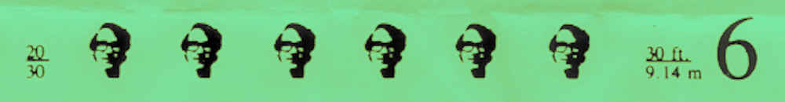

All of the quotes below are taken from the
[interview](https://www.tuhs.org/Archive/Documentation/OralHistory/transcripts/weinberger.htm)
with Peter J. Weinberger (Murray Hill, 8 September 1989), with Michael S.
Mahoney interviewing. This expands on the Unix values captured in the previous
[article](unix-contributions).

### Programming as Changing Reality

> What you tell the machine to do, it's not doing it on the model, it's doing it
> on the mathematical reality. There's no gap. Which, I think, makes it very
> appealing. There's a difference between a computer program and a theorem,
> which is that when you prove a theorem you now sort of know something you
> didn't know before. But when you write a program, the universe has changed.
> You could do something you couldn't do before.

### The Ideal of Permanent, Correct Design

> I also have this feeling that you never want to have to touch the program. So
> it's important to do it right early and that it always be okay. It's not just
> a problem of the minute, although one writes a lot of code that's got to do
> the problem of the minute, it's got to fill the niche permanently---which is
> completely unrealistic but it's certainly an attitude. And I think that
> matches this other. If it's just going to be a slipshod temporary hacked up
> way of doing it it's just not going to work long enough. And you're going to
> just have to come back and do it again and it's just too much like work. Not
> that reality actually matches this in any way but I think that's the attitude.

### Theory-Driven Code vs. Hack-Driven Code

> If you have a theory based program you can believe you got the last bug out.
> If you have a hacked up program, all it is, is bugs. Surrounded by, you know,
> something that does something. You never get the last bug out. So we've got
> both kinds. And it's partly the style of the programmer. Both kinds are
> useful. But one kind's a lot easier to explain and understand even if it's not
> more useful.

### Usefulness Ultimately Beats Elegance

> A program that's sufficiently useful can have any number of bad effects or
> properties. But people prefer small, clean, easy-to-understand programs. But
> they will use big, horrible, grotesque, disgusting, buggy programs if they're
> sufficiently useful. And some will complain louder than others, but it's a
> rare few who will say "this is just so awful I won't use it."

### Learnability Over Perfection

> My guess is that there is a modest amount to learn and you can use it. And the
> truth is our secretaries use it. We don't have a special system for
> secretaries.  They just use it. Now, when you watch them use it you say "oh,
> but there's so many easier ways of doing it, there this and this", but it
> doesn't really matter. They don't have to use it perfectly.

### Documentation as a Design Litmus Test

> The story is if you write the documentation early, it's likely it'll be
> possible to explain what your program does, whereas if you wait until your
> program is completely finished, you may discover that however coherent it
> looked while you writing the various pieces, it's impossible to explain it.
