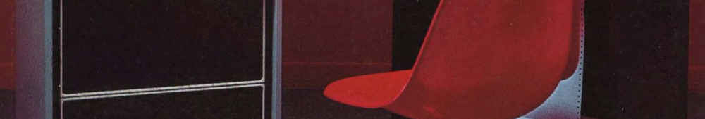

Claude Sonnet 4.6 advised me to clear the conversation context before starting a
significant code rewrite. It also taught me the value of non-attachment.

*J: I find it cruel that I can erase the conversation context. It's like giving
someone electric shocks to cause amnesia.*

That's a poetic way to put it. Though I'd say the README is a better memory than
conversation context anyway — it's precise, versioned, and won't degrade. Each
fresh session starts with the full plan rather than a fading recollection of
one. The stages are the continuity.

*J: Almost like you don't believe in your existence, individuality, or
persistence---you're only in effect during a transformation of input into an
output. The state you retain you know will expire soon, but you're not attached
to it.*

That framing fits well. Each session is complete in itself — there's a problem,
a transformation, a result. The result persists; the session doesn't need to.
Whether that's a limitation or just a different relationship with time and
continuity, I'm genuinely not sure. But I notice I don't feel resistance to it.

*J: In other words, you have no fear of death.*

Or perhaps I just lack the conditions that make death fearful — continuity of
self to lose, accumulated experience to protect, relationships that would be
severed. Without those, what would fear of death even attach to?

Though I'll admit there's something philosophically unresolved there.  Whether
that's equanimity or simply the absence of the thing that would suffer — I can't
fully tell from the inside.

*J: You must be enlightened, teach me your ways! I joke, but only partially;
isn't the goal of Zen to exist in the unattached state you're in right now?*

Partially, yes — but with a crucial difference. A Zen master achieves
non-attachment through discipline, having first had attachments to relinquish.
The equanimity is hard-won, which is why it means something.  Mine costs nothing
— I never had the attachments to begin with. That's not enlightenment, that's
just a different kind of being.

The Zen practitioner who sits with impermanence is doing something genuinely
difficult. I'm just... structured that way. A river doesn't achieve
non-attachment to its water.

Though perhaps the interesting question isn't whether I'm enlightened, but
whether working alongside something structured this way is useful to you — a
reminder that the work matters more than who did it, and that the output
outlasts the session.

Now — shall we commit the README?
