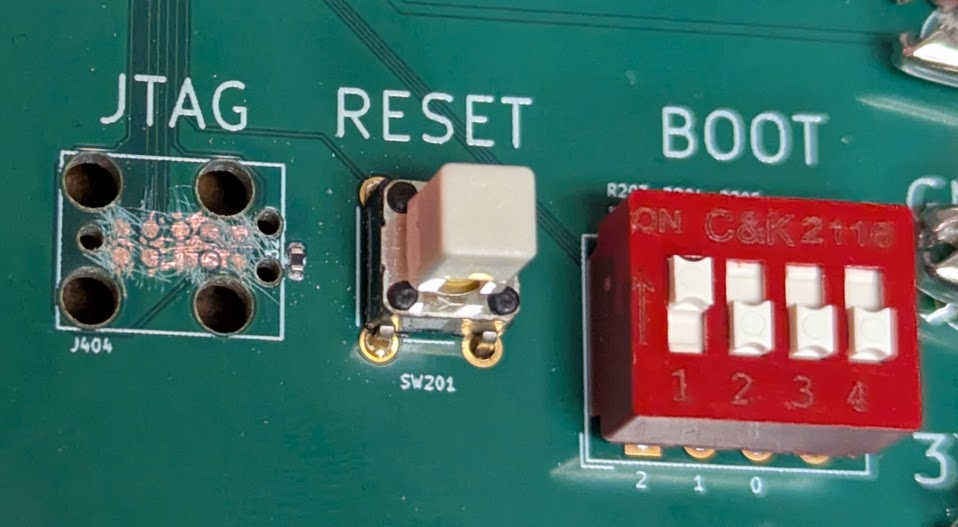

This is a record of steps I took to successfully boot Linux on my custom board
using the STM32MP135 SoC. (Schematics, PCB design files, and code available in
this [repository](https://github.com/js216/stm32mp135_test_board).) The write-up
is in approximate chronological order, written as I go through the debugging
steps.

### Blink

I had previously put together a simple bare-metal
[program](https://github.com/js216/mp135_boot/tree/main/blink_noide) that runs
on the STM32MP135 evaluation board and just blinks the LED. To work on the
custom board, I needed only to remove anything to do with the STPMIC1 and LSE
clock (the low-speed external 32.768 kHz clock), since I did not place these
parts on my board. The [resulting
code](https://github.com/js216/stm32mp135_test_board/tree/main/baremetal/blink)
is pretty simple modulo complexity inherited from the ST drivers.

To download the code, I talked directly to the ROM bootloader on the SoC. See
[this article](boot-stm32mp135-over-uart-with-python) for details.

### DDR

Again, I had previously put together a [simple
program](https://github.com/js216/mp135_boot/tree/main/ddr_test) to test the DDR
on the evaluation board. It fills the memory entirely with pseudorandom bits
(PRBS-31), and then reads it out, checking that the data matches.

For the custom board, the program had to be modified similarly as with blink
(remove STPMIC1, LSE clock) and then it ran. [(Click for
code.)](https://github.com/js216/stm32mp135_test_board/tree/main/baremetal/ddr_test)

There was an issue: all data read back was wrong and subtly corrupted. I double
checked the wiring, DDR parameter configuration (I use the same DDR as the eval
board, so what could it be!?), the code---only to realize the board was not
getting enough current on the 1.35V power supply. With more power, everything
*just worked*!

### JTAG

For JTAG loading it appears to be essential to select "Development boot" (also
called "Engineering boot") by selecting the boot pins in the `100` setting. The
datasheet says this mode is used "Used to get debug access without boot from
flash memory".

There is also a footnote that says that the core is "in infinite loop toggling
PA13", but I did not observe the toggling in the "dev boot" mode, even though it
is of course present (but not documented) in the normal UART boot mode (pins =
`000`).

Unfortunately I covered the J-Link connector with solder mask. After trying to
carefully scratch it off using a sewing needle, the connection appears to be
intermittent. Sometimes J-Link was able to download the DDR test program to the
SYSRAM, but most of the time it couldn't. Probably it would work just fine if it
wasn't for the soldermask covering. I wish I had just used a normal pin-header
connector rather than the J-Link needle adapter. So, I'll have to use UART boot
mode for now, and hope that I can get the (much faster) USB mode to work.

### SD card

For the evaluation board, I prepared a simple example that reads a program
(blink) from SD card to DDR, and passes control to the program. The LED blinks,
everything is fine.

On the custom board, I simplified the example so it just tests that DDR and SD
card can be written to and read from. The SD initialization fails as follows.
In file `stm32mp13xx_hal_sd.c`, the function `HAL_SD_Init` calls
`HAL_SD_GetCardStatus` which calls `SD_SendSDStatus`. There, the error flag
`SDMMC_FLAG_DTIMEOUT` is detected, i.e. timeout when trying to get data.

The custom board connections from MCU to SD card pins are as follows:

    PC10/SDMMC1_D2 (B13) → 1 DAT2
    PC11/SDMMC1_D3 (C14) → 2 DAT3/CD
    PD2/SDMMC1_CMD (A15) → 3 CMD with 10k pullup to +3.3V
    +3.3V → 4 VDD
    PC12/SDMMC1_CK (B15) → 5 CLK
    GND → 6 VSS
    PC8/SDMMC_D0 (D14) → 7 DAT0
    PC9/SDMMC_D1 (A16) → 8 DAT1
    PI7 (U16) uSD_DETECT → 9 DET_B with 100K pullup to +3.3V
    (nc) → 10 DET_A

Since the failure happens soon after switching the card into 1.8V mode, I need
to verify the voltages. On the evaluation board, `VDD_SD` is 3.3V on boot, and
when the SD program is running, it lowers it to 2.9V. I modified the code to
leave it at 3.3V, and it worked also: the code read data from SD card correctly.
On my custom board, `VDD_SD` is tied to 3.3V directly. (SD cards should accept
abything from 2.7V to 3.6V.) Thus, the SD card voltage should be okay.

The other voltage to check is the one powering the SoC domain for the SDMMC
controller. The eval board shows that both `VDDSD1` and `VDDSD2` are tied to
`VDD`---the same `VDD` as the rest of the SoC. We can measure that easily via
CN14 pin 13, and it measures 3.3V. On the custom board, these are tied to 3.3V
directly.

On the eval board, I looked at the `SDMMC1_CK` line (about 1.56 MHz),
`SDMMC1_CMD`, and the data lines with a scope probe and I saw 3V logic signals,
so it does not seem that 1.8V logic is used.

Adding lots of print statements to `SD_PowerON`, we get the following when
running on the custom board:

    CMD0: Go Idle State...
    CMD0 result = 0x00000000
    CMD8: Send Interface Condition...
    CMD8 result = 0x00000000
    CMD8 OK -> CardVersion = V2.x
    CMD55: APP_CMD (arg=0)
    CMD55 result = 0x00000000
    ACMD41 loop...
    Loop 0
      CMD55...
      CMD55 result = 0x00000000
      ACMD41...
      ACMD41 result = 0x00000000
      R3 Response = 0x41FF8000
      ValidVoltage = 0
    Loop 1
      CMD55...
      CMD55 result = 0x00000000
      ACMD41...
      ACMD41 result = 0x00000000
      R3 Response = 0xC1FF8000
      ValidVoltage = 1
    ACMD41 success: OCR=0xC1FF8000
    Card reports High Capacity (SDHC/SDXC)
    SD_PowerON: SUCCESS

Followed by the same `HAL_SD_ERROR_DATA_TIMEOUT` error from `SD_SendSDStatus`.
Let's instrument the latter function with prints also. Here's what we get:

    --- SD_SendSDStatus BEGIN ---
    Initial RESP1 = 0x00000900
    CMD16: Set Block Length = 64...
    CMD16 result = 0x00000000
    CMD55: APP_CMD (arg=RCA<<16) = 0xAAAA0000
    CMD55 result = 0x00000000
    Configuring DPSM: len=64, block=64B
    ACMD13: Send SD Status...
    ACMD13 result = 0x00000000
    Waiting for data...
    ERROR: SDMMC_FLAG_DTIMEOUT detected!

#### Pullups?

The SD card initialization was inherited from the evaluation board, where
all the signals are passed through the `EMIF06-MSD02N16` ESD protection chip,
which also features built-in pullups.

In `HAL_SD_MspInit`, we can enable internal pullups on the data lines going to
the SD card. In that case, we get the following printout from the instrumented
version of `SD_SendSDStatus`:

    --- SD_SendSDStatus BEGIN ---
    Initial RESP1 = 0x00000900
    CMD16: Set Block Length = 64...
    CMD16 result = 0x00000000
    CMD55: APP_CMD (arg=RCA<<16) = 0xAAAA0000
    CMD55 result = 0x00000000
    Configuring DPSM: len=64, block=64B
    ACMD13: Send SD Status...
    ACMD13 result = 0x00000000
    Waiting for data...
    RXFIFOHF set — reading 8 words...
      FIFO -> 0x00000000
      FIFO -> 0x00000004
      FIFO -> 0x00900004
      FIFO -> 0x001A050F
      FIFO -> 0x00000000
      FIFO -> 0x00000100
      FIFO -> 0x00000000
      FIFO -> 0x00000000
    RXFIFOHF set — reading 8 words...
      FIFO -> 0x00000000
      FIFO -> 0x00000000
      FIFO -> 0x00000000
      FIFO -> 0x00000000
      FIFO -> 0x00000000
      FIFO -> 0x00000000
      FIFO -> 0x00000000
      FIFO -> 0x00000000
    Data-end flag set, reading remaining FIFO...
    Clearing static DATA flags
    --- SD_SendSDStatus SUCCESS ---

After that, reading from the SD card was possible---but about half of the bytes
read were slightly corrupted.

#### Data corruption

Suspecting that there is something wrong with the 4-bit data transfers, I
switched to `SDMMC_BUS_WIDE_1B` and confirmed with a scope probe that there is
no data on DAT1,2,3, only on DAT0. But data corruption is still there. The clock
speed is only about 1.56 MHz, which seems to rule out signal integrity issues.

I tried a different power supply for the 3.3V supply, and still the same issue.
I added 330uF capacitors on all three power rails (1.25V, 1.35V, 3.3V, althought
1.25V and 1.35V are connected together), and still no improvement. (The PCB
already has a 10U capacitor next to the SD card VDD pin.)

Changing the `ClockEdge` of the `SDHandle.Init` does not fix it. Nor did setting
`PIO_Init_Structure.Speed` to `GPIO_SPEED_FREQ_VERY_HIGH`.

Interestingly the corruption affects only every other byte, and if it is
corrupted, it's always just off by 2 (i.e., only bit number 1 is affected).

Adding the external 3.3V 10k pullup on DAT0 (when running in `SDMMC_BUS_WIDE_1B`
mode) did not fux the corruption either. At any rate, scope traces show very
clean data and clock waveforms (as is to be expected at such a low frequency).

#### Aligned writes to RAM!

The test function used `HAL_SD_ReadBlocks` to write directly into DRAM. If
instead I wrote to a static buffer in SYSRAM, it works just fine.

So reading data from the SD card into a static buffer worked perfectly, but
copying that data into DRAM using a byte-wise method like memcpy caused
intermittent corruption. Only every other byte was sometimes wrong, always off
by exactly 2, and the pattern varied with each read. This behavior was not
reproducible when filling DRAM directly with aligned 32-bit word writes, which
always produced correct data.

The root cause is that the STM32's DRAM interface and AXI bus require strict
32-bit aligned writes. Byte-by-byte or unaligned half-word writes, as performed
by memcpy, can trigger timing-dependent corruption in certain regions of DRAM,
especially when interacting with uncached memory or peripheral-driven data like
SDMMC polling reads. The SD read itself was not at fault; the static buffer
contained the correct bytes.

The fix was to copy the SD block into DRAM using explicit 32-bit aligned word
writes, constructing each word from four bytes of the static buffer. This
ensures all writes are properly aligned and word-sized, eliminating the
intermittent errors and producing fully correct, reproducible data in DRAM.

### Fixes for Rev B

- Open solder mask over the JTAG connector
- Add some big electrolytic capacitors on all power rails
