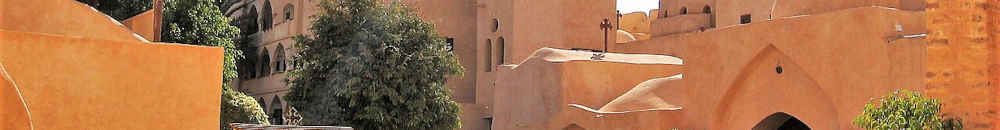

*Notes while reading The Conferences of John Cassian, Conf. 1, chs. I--VIII.*

#### Places and people

- Desert of Scete (*heremo Sciti*) is an hour and a half drive northwest from
  Cairo. It "became one of Christianity's most sacred areas" (Wikipedia),
  presumably because of the abbots mentioned in these Conferences.

- John Cassian, lived about 360--435, spent decades in the Middle East.

- Germanus, Cassian's best friend, traveled with him in Palestine.

- Blessed Pope Castor (*beatissimo papae Castori*), mentioned in the Preface,
  refers to [Castor of Apt](https://en.wikipedia.org/wiki/Castor_of_Apt), who
  was the bishop of Apt (southern France).

- Blessed Pope Leontius (*beatissime papa Leonti*).

- Holy brother Helladius (*sancte frater Helladi*).

#### Things better and things worse

- **Better*: Helladius followed the sublime customs of the Anchorites
  (*anachoretarum instituta sublimia*) from their traditions (*illorum
  traditionibus*)

  **Worse**: Like some others, presumptuously on his own account (*non ut
  quidam propria adgressus est praesumptione sectari*); from his own ideas
  (*suis adinventionibus*).

- Anchorite's life is grander than that of the Coenobium; contemplation of
  God [...] more sublime than ordinary practical life (*a coenobiis
  anachoresis et ab actuali uita [...] maior actuque sublimior est*)

#### Scopon vs telos

All arts and sciences (*omnes artes ac disciplinae*) have two kinds of purposes:

- Goal or mark (*scopon, id est destinationem*). Compare σκοπός: goal, aim,
  desired result. Without the target goal you can't even know how wrong you've
  gotten. Traveling in the wrong direction you get all the trouble and get none
  of the good of the journey.

  - Purity of heart (*puritas cordis*)
  - Sanctification

- Ultimate end or aim (*telos, hoc est finem proprium*). Compare τέλος: aim,
  purpose, end goal, design.

  - Kingdom of heaven --- regnum caelorum
  - Eternal life --- vita aeterna
  - Heavenly prize --- finem caelestis

#### Strange practices

- Want of food in fasting --- ieiuniorum inedia
- Weariness of vigils --- vigiliarum lassitudo
- Reading and constant meditation on the Scriptures --- lectio ac meditatio
  scripturarum continuata
- Incessant toil --- labor incessabilis
- Nudity --- nuditas
- Self-denial and privation of all things --- nuditasque et omnium rerum
  priuatio
- Horrors of this vast desert --- horror huius vastissimae solitudinis

### Few things, one thing

> "few things" are needful for perfect bliss, i.e., that contemplation which is
> first secured by reflecting on a few saints: from the contemplation of whom,
> he who has made some progress rises and attains by God's help to that which is
> termed "one thing," i.e., the consideration of God alone
