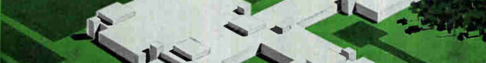

Complex problems can be broken down into steps that are small and easy, or, at
worst, small and tedious. A big chess game unfolds move by move. In life too,
you can only make one move at a time, and then it's the universe's turn.

The only question is, what is my move right now? But few ask it. Be aware!
