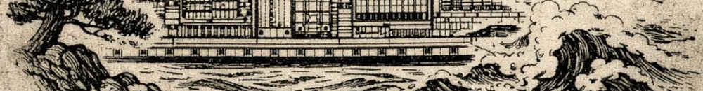

*Disclaimer: I'm not a theologian, proceed at your own risk.*

An astute reader of the [Notes on Cassian](notes-on-cassian) noticed a wild
claim of mine, that "being dead to the wold" means afterlife, when examining
Cassian's thoughts on divine contemplation and "seeing God", in [Conf. 1, Ch.
XV](https://ccel.org/ccel/cassian/conferences/conferences.ii.ii.xv.html). Let's
take a closer look.

I don't think you can "see God", no matter how "pure" or "dead to the world" you
are. To be fair, Cassian only makes the converse claim: *if*, any carnal
affections survive in you, *then* you cannot lastingly contemplate God. Am I
going too far by assuming Cassian implied the reverse claim: you *could*
lastingly contemplate God *if only* no carnal affections survive in you?

A parallel set of claims arises from his scriptural quote. Exodus states that
*if* you see God, *then* you cannot live. Cassian elaborates: you cannot live to
"this world and to earthly affection" (*mundo huic affectibusque terrenis*). The
implied reverse statement in this case is, *if* you're "dead to the world",
*then* you may be able to see God. Again, did Cassian intend this implication or
am I reading into it too far?

There's only two options, either he did mean it or he did not. If he did not
mean it, then we could discuss whether carnal affections (*carnalis affectus*)
prevent you from contemplating God "lastingly" (*perpetuo*), or from seeing God.
Since I'm not at this point interested in studying perpetuity, i.e., eternity or
afterlife, so let's pass on to the other option: Cassian *did* mean the
"reversed claim": purify your heart and you'll be able to see God now and
forever.

To get any further, we need to clarify two phrases which, to my mind, have lost
all their meaning through overuse: carnal affections; being dead to the world.

### What's a Carnal Affection?

Over the centuries, claiming that "carnal affections are bad" acquired the
status of a near truism in a certain vein of writings. A good starting point
would be the Rom 8:6--8:

> For to be carnally minded is death; but to be spiritually minded is life and
> peace. Because the carnal mind is enmity against God: for it is not subject to
> the law of God, neither indeed can be. So then they that are in the flesh
> cannot please God. [KJV]

### Dead or Alive to the World

this vein of reasoning as seriously misguided. The point at which we leave
behind the flesh is the point at which we die, anything else is pretentiousness.

