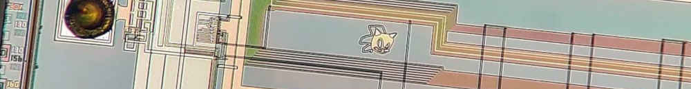

In the [previous article](boot-sharc-dsp-over-uart), we compiled a "blink"
program and sent it to the ADSP-2156 chip via UART. Now we can try to do the
same over a faster interface: QSPI.

### FTDI QSPI to USB

The quad `SPI2` interface on the evaluation board
[EV-SOMCRR-EZLITE](https://www.analog.com/en/resources/evaluation-hardware-and-software/evaluation-boards-kits/EV-SOMCRR-EZLITE.html)
is connected to the `FT4222HQ-D-T` chip that connects to one of the USB-C ports
on the carrier boards. The same FTDI part also controls a GPIO expander,
`ADP5587ACPZ-1`, which is in charge of the LEDs on the carrier boards as well as
two signals relevant for the QSPI interface: `USB_QSPI_EN*` and
`USB_QSPI_RESET*` (the asterisks indicate an active-low wire).
