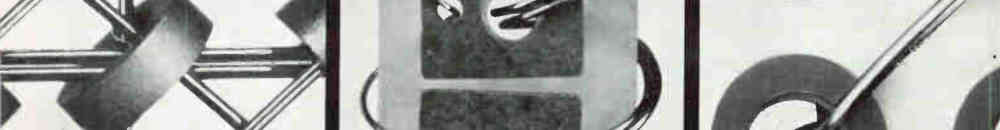

Consciously, I can only focus on one thing at a time, and hold only a few in
working memory. But the unconscious part of the psyche can hold a tremendous
amount of memories, skills, goals, and intentions.

When a lot needs to be done, it's best to banish it all from the conscious mind
and merely set unconscious intentions, then let things arise one by one as
appropriate until the goal is achieved. Holding awareness of multiple tasks is
like carrying ten full cups of tea: I'd get nowhere or spill them all.

By trusting your unconscious, you free your conscious attention for the one
action in front of you.
