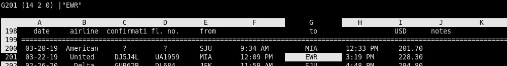

If your mental model of a spreadsheet includes long startup times, heavy GUIs,
and layers of menus, sc is almost a shock. Written in the early 1980s
(originally by James Gosling and later maintained by others in the Unix
community), it's a tiny curses-based spreadsheet that feels significantly faster
than most modern tools. sc starts instantly, every action is a one- or
two-keystroke command, and everything is plain text: the file format, the
config, even how you automate it. Let's learn how to use it.

1. Quick Hook: Why sc Is Still Worth Learning

You can script it from the shell, version-control sheets, generate them
programmatically, or pipe data straight in and out. It's basically a spreadsheet
that behaves like a real Unix program—simple, predictable, and extremely
efficient. If you've never used a spreadsheet that fits in your mental cache and
your muscle memory at the same time, sc is worth a look.

- Ultra-fast startup and zero-latency UI
- Entirely keyboard-driven (1–2 keystrokes per action)
- Text-based file format: diffable, scriptable, version-controllable
- Works in SSH, serial consoles, recovery environments
- Extremely small footprint; runs anywhere
- Integrates naturally with shell scripts and pipelines

2. What sc Looks Like (First Screenshot)

- Show a simple sheet
- Point out the command line at top/bottom
- Note the curses-style navigation

3. The Absolute Basics (Getting Oriented in 60 Seconds)

- How to open and exit (sc, q)
- Moving around cells (hjkl / arrow keys)
- Editing a cell (= for formulas, plain text entry for values)
- Saving/loading (w filename, r filename)
- Undo/redo basics

4. Essential Commands (Minimal Working Set)

- Entering formulas
- Copy/paste (ranges + commands)
- Basic arithmetic and functions
- Row/column insert/delete
- Range referencing
- Recalculation commands

5. "Why It's Fast": The Keystroke Model

- Single-key commands (vi-like)
- No modal lag or UI redraw delays
- Command sequences are predictable and scriptable
- Behavior designed around minimal keypresses

6. Shell Integration That Modern Sheets Can't Do

- Generating sheets from scripts
- Piping data into sc (cmd | sc)
- Converting to/from CSV
- Embedding sc in TUI workflows
- Batch operations with psc/sc filters

7. Scripting & Automation

- Using macros
- Assigning commands to keys
- Running sc in non-interactive mode
- Integrating with Makefiles or cron jobs
- Using awk/sed as pre/post processors

8. File Format: Human-Friendly and Hackable

- Plain text structure
- Reading/patching sheets in editors
- Version control advantages
- Grep-friendly cell references

9. Navigation Tips & Quality-of-Life Tricks

- Jumping to ranges
- Setting marks
- Quick formatting
- Column width adjustments
- Useful config defaults

10. Dealing With the Quirks

- Why it behaves this way (historical design)
- Minimal UI conventions (status line, prompts)
- Character limitations and workarounds
- Terminal-size considerations

11. Beyond the Basics

- Using extended versions like sc-im (optional mention)
- Unicode limitations / strengths
- Performance with large sheets
- Custom keybindings and themes

12. Conclusion: When sc Shines

- Lightweight deployments, SSH sessions
- Embedded systems and limited environments
- Large datasets where GUI tools slow down
- When reproducibility and scriptability matter
- When you want a spreadsheet you can control

### UI is expressive and concise

I'm no longer convinced anybody knows anything about user interface. It's clear
some things are easier to use and some things are harder to use. That's okay.
But it's also clear that people learn a lot.[^wein]

[^wein]: From an
  [interview](https://www.tuhs.org/Archive/Documentation/OralHistory/transcripts/weinberger.htm)
  with Peter J. Weinberger (Murray Hill, 8 September 1989), with Michael S.
  Mahoney interviewing.
